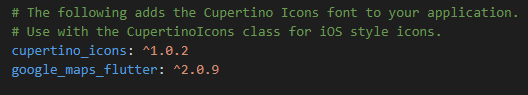
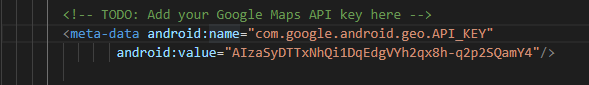
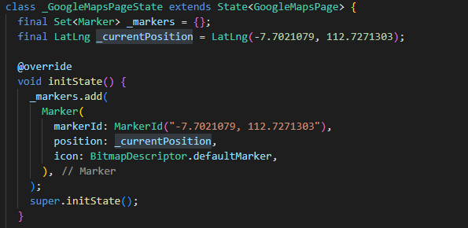
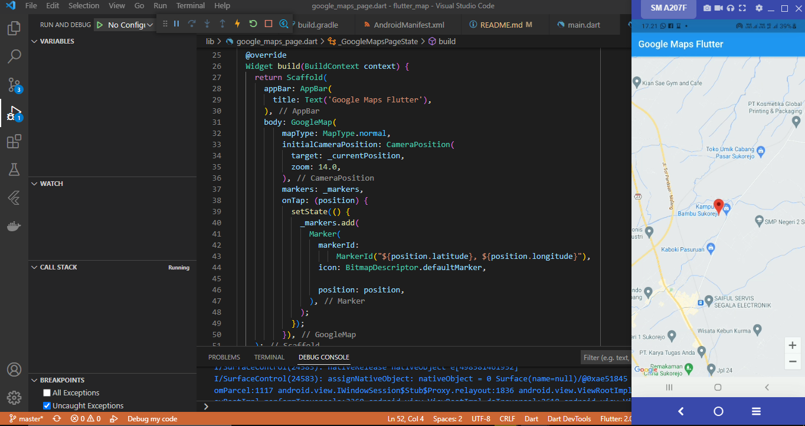

# Maps On Flutter

### 1. Menambahkan plugin google_maps_flutter pada pubspec.yaml lalu di pub get

### 2. Menambahkan API Key Google Maps di AndroidManifest.xml

### 3. Membuat class google_maps_page.dart dengan mengatur tampilan dari aplikasi maps yang memiliki panjang Latitude dan Longitude sesuai dengan alamat rumah = -7.7021079, 112.7271303. 

### 4. Menampilkan Aplikasi Maps dengan Posisi Marker Maps yaitu Alamat Rumah

